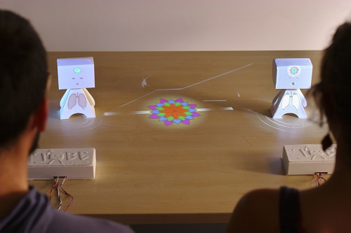

# Tobe: Tangible Out-of-Body Experience

We propose a toolkit for creating Tangible Out-of-Body Experiences: exposing the inner states of users using physiological signals such as heart rate or brain activity. Tobe can take the form of a tangible avatar displaying live physiological readings to reflect on ourselves and others. Such a toolkit could be used by researchers and designers to create a multitude of potential tangible applications, including (but not limited to) educational tools about Science Technologies Engineering and Mathematics (STEM) and cognitive science, medical applications or entertainment and social experiences with one or several users or Tobes involved.

<iframe src="https://player.vimeo.com/video/142287968" width="500" height="281" frameborder="0" webkitallowfullscreen mozallowfullscreen allowfullscreen ></iframe>

This project extends what we did with [Teegi](https://team.inria.fr/potioc/scientific-subjects/teegi-tangible-eeg-interface/). We wanted to give access to high-level signals with a meaningful feedback and explore multi-user applications. Through a co-design approach, we investigated how everyday people picture their physiology and we validated the acceptability of Tobe in a scientific museum. We also give a practical example where two users relax together, with insights on how Tobe helped them to synchronize their signals and share a moment -- see the [associated paper](https://hal.inria.fr/hal-01215499).

The various elements that compose the toolkit are available through [Conphyture](https://github.com/conphyture) and [Introspectibles](https://github.com/introspectibles). The former holds components related to physiological sensors and signal processing, the latter holds the building blocks related to the support and to the feedback. 

We plan to test the use of Tobe on the long term -- several weeks --  both for fostering wellbeing and enhancing social presence.
